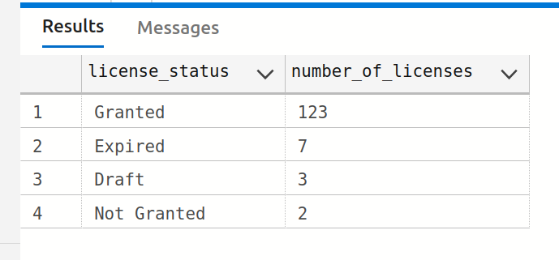
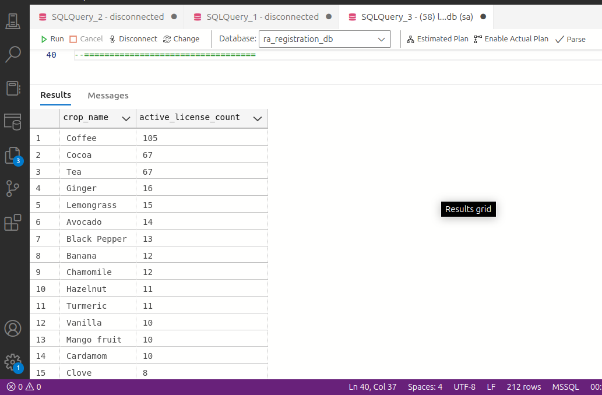
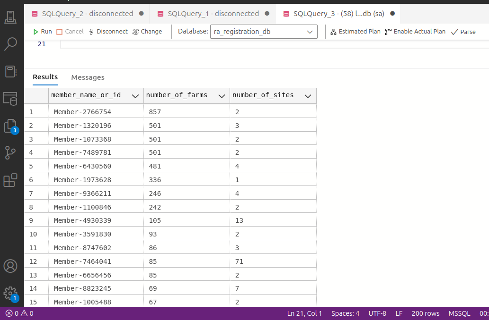

### Reports
1. **Assess the data regarding data quality. Make recommendations when necessary.**
  - Covered in this [directory](/scripts/quality-checks/).

2. **Make a report/query showing the number of licenses per status.**
  - Covered in this [script](/scripts/analytics/00_license_status.sql):

3. Make a report showing the number of active licenses per crop.
  - Covered in this [script](/scripts/analytics/01_licenses_per_crop.sql):

4. Make a report showing the number of farms and sites per member.
  - Covered in this [script](/scripts/analytics/03_farms_sites_per_member.sql):

